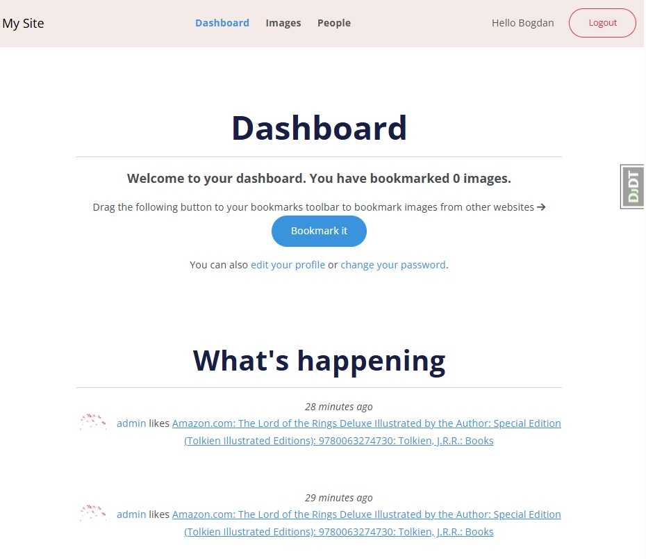

# Opis aplikacji

Aplikacja **Bookmarks** umożliwia użytkownikom rejestrację, edycję profilu, zarządzanie hasłami, oraz interakcję z obrazami. Użytkownicy mogą dodawać obrazy do zakładek, udostępniać je innym użytkownikom, polubić obrazy, a także śledzić innych użytkowników. Aplikacja zapewnia funkcjonalności związane z rankingiem obrazów, śledzeniem aktywności oraz powiadomieniami za pomocą systemu wiadomości Django. Wykorzystuje Redis do liczenia wyświetleń obrazów oraz weryfikację użytkowników przez Google.

### Funkcjonalności
- Rejestracja użytkownika: Możliwość rejestracji nowych użytkowników.
- Zarządzanie hasłem: Zmiana hasła oraz resetowanie hasła.
- Edycja profilu: Użytkownicy mogą edytować swoje dane profilowe.
- Autentykacja: Obsługa logowania i wylogowywania użytkowników.
- Udostępnianie obrazów: Użytkownicy mogą dodawać obrazy do zakładek i dzielić się nimi z innymi użytkownikami.
- Obserwowanie innych użytkowników: Możliwość śledzenia aktywności innych użytkowników.
- Polubienia obrazów: Użytkownicy mogą polubić obrazy, które dodali do swoich zakładek.
- Bookmarkowanie obrazów z internetu: Możliwość bookmarkowania dowolnych obrazów dostępnych w internecie.
- Aktywność użytkowników: Użytkownicy mogą zobaczyć aktywność innych użytkowników.
- Ranking obrazów: Możliwość wyświetlania obrazów w rankingu na podstawie liczby wyświetleń.
- Autentykacja przez Google: Użytkownicy mogą logować się za pomocą konta Google.
- Powiadomienia: Powiadomienia użytkowników o ważnych zdarzeniach (np. nowe polubienie obrazu).
- Zabezpieczenie przed używaniem istniejącego adresu e-mail: Aplikacja zapobiega rejestracji z tym samym e-mailem przez różnych użytkowników.
- Liczenie wyświetleń obrazów za pomocą Redis: Wyświetlenia obrazów są liczone z użyciem Redis, co pozwala na szybkie aktualizowanie liczby wyświetleń.

### Technologie
- Django - framework webowy do budowy aplikacji.
- Redis - system bazodanowy do przechowywania danych w pamięci (wyświetlenia obrazów).
- SQLite - bazodanowy system zarządzania bazą danych (domyślna baza danych).
- Social-auth-app-django - integracja z usługami autentykacji (Google).
- Easy-thumbnails - biblioteka do generowania miniatur zdjęć.
- django-debug-toolbar - narzędzie do debugowania aplikacji Django.

### Jak uruchomić aplikację
1. Sklonuj repozytorium:
```
git clone https://github.com/dmurawski/social_webisite.git
```
2. Zainstaluj wymagane pakiety:
```
pip install -r requirements.txt
```
3. Uruchom Redis:
```
docker pull redis:7.2.4
docker run -it --rm --name redis -p 6379:6379 redis:7.2.4
```
4. Uruchom serwer Django z certyfikatem SSL
```
python manage.py runserver_plus --cert-file cert.crt
```
### Ustawienia i konfiguracja
- Django Settings: Skonfiguruj odpowiednio plik settings.py zgodnie z wymaganiami projektu (np. ustawienia bazy danych, połączenie z Redis, konfiguracja Google Authentication).
- Certyfikaty SSL: Aby uruchomić serwer z HTTPS, musisz posiadać plik certyfikatu (cert.crt).

### Endpointy
- /account/ - Dashboard użytkownika
- /account/users/ - Lista użytkowników
- /account/password_change/ - Zmiana hasła
- /account/logout/ - Wylogowanie
- /account/login/ - Logowanie
- /account/register/ - Rejestracja
- /account/password_reset/ - Resetowanie hasła
- /account/edit/ - Edycja profilu użytkownika
- /account/users/follow/ - Śledzenie użytkownika 
- /account/users/</username>/ - Profil użytkownika
- /images/ - Lista obrazów
- /images/create/ - Tworzenie nowego obrazu
- /images/like/ - Polubienie obrazu
- /images/ranking/ - Ranking obrazów
- /images/detail/<int:id>/<slug:slug>/ - Szczegóły obrazu
